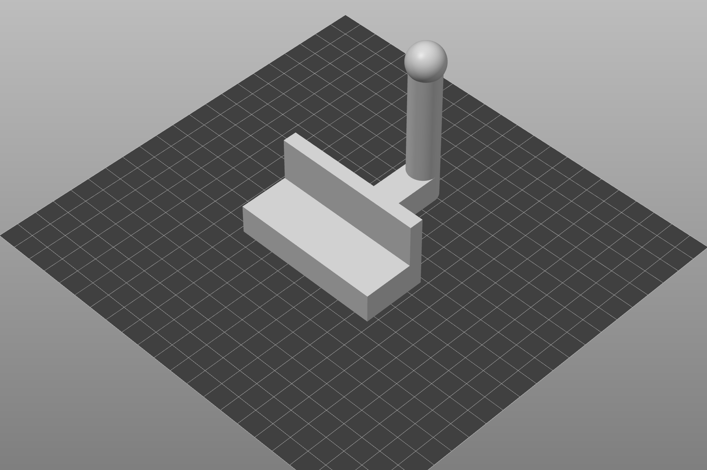
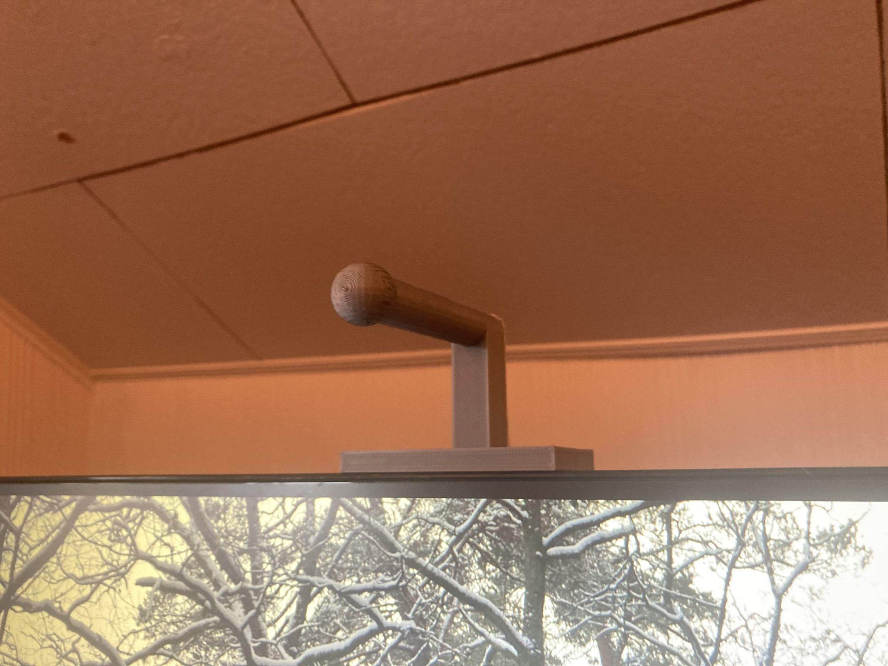
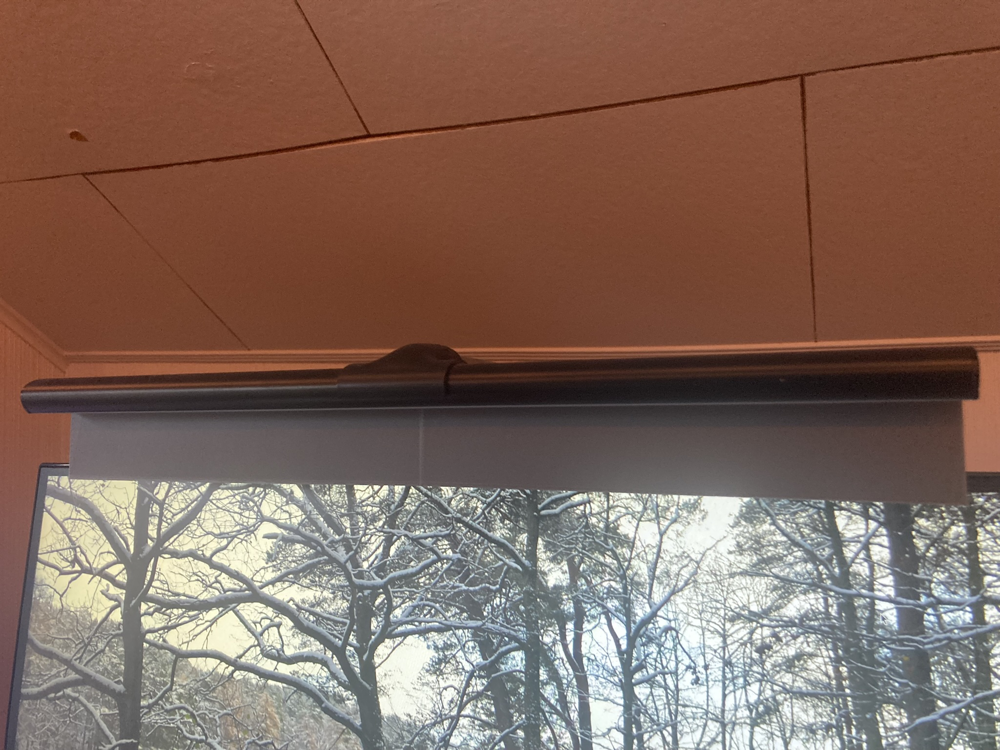

# Monitor lamp holder

The cheap ball socket mount came with my desk lamp broke so I created one that attaches to the top of my monitor using a command strip.

The placement worked well to illuminate my desk but it caused a reflection on my screen. To prevent this, I printed some blinds and hot glued them on.

