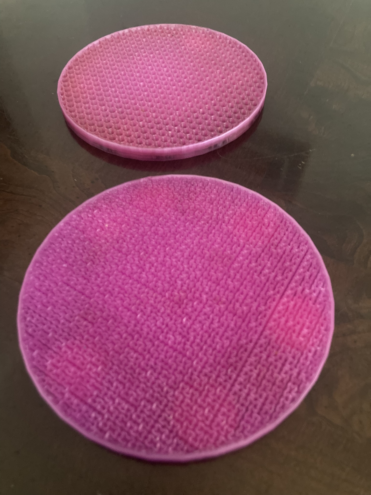

# Infill Pattern Coaster

A coaster that shows off interesting infill patterns in 3D printing. 

The model includes 12 slots for pennies to be inserted during the printing process to add some weight to the print.

The top couple of layers of the print should be removed in your slicer settings.